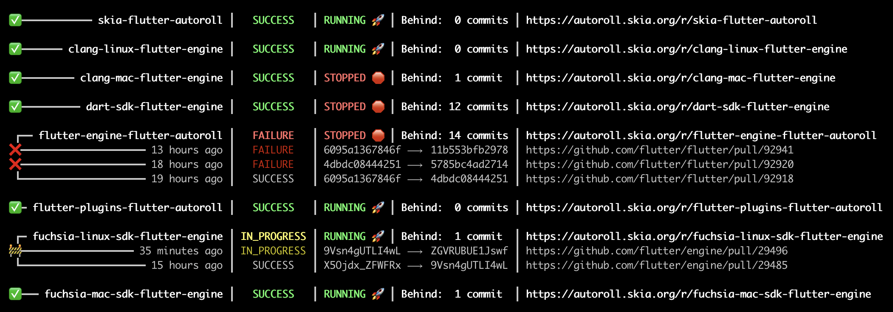

# rollerdash
A simple client for querying the Skia AutoRoll service.

## Usage

1. Clone this repository.
1. `dart run`

> **_NOTE:_** This tool uses ANSI escape codes and unicode glyphs. Output won't appear to be properly formatted in terminals that don't support one or both of these features.

## Develop

When making any changes to `schema.dart`, run `dart run build_runner build` to regenerate `schema.g.dart`.
