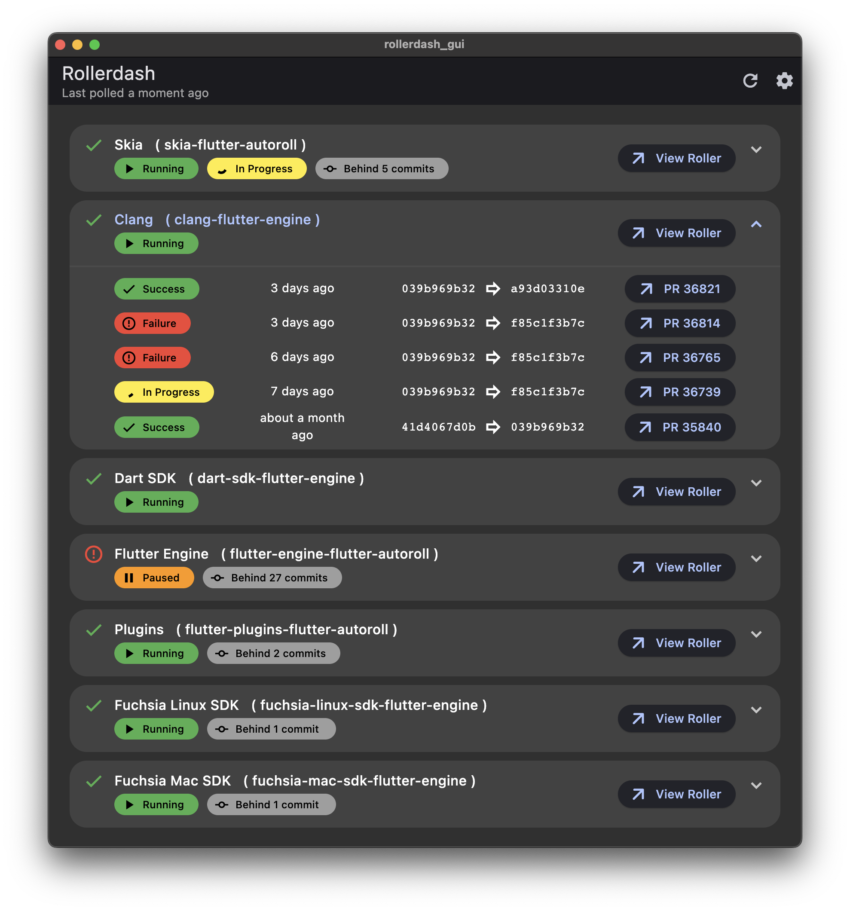

# Rollerdash GUI



> **_NOTE:_** This Flutter application is intended to run against the [master channel](https://github.com/flutter/flutter/wiki/Flutter-build-release-channels#flutters-channels) and is updated on an as-needed basis.

## Quick start

In order to simplify migration upkeep, we forego version controlling most platform-specific build files. The intention is to support the templated defaults generated by `flutter create .` on the [master channel](https://github.com/flutter/flutter/wiki/Flutter-build-release-channels#flutters-channels).

```bash
cd rollerdash_gui
flutter create .
flutter pub upgrade
flutter pub get
flutter run
```

## Deployment

Rollerdash is deployed to GitHub pages and is accessible via https://bdero.me/rollerdash/.
The `gh-pages` branch containes the deployed web build.

> [!NOTE]
> For convenience, `build/web/` is a submodule pointing to `gh-pages`.

### Deployment instructions

```bash
# 1. Initialize/update git submodules.
git submodule update --init --recursive

# 2. Check out the gh-pages branch and clear the currently deployed build.
pushd ./build/web
git checkout gh-pages
rm -r ./*
popd

# 3. Clean and re-build the web target.
flutter build web --base-href="/rollerdash/" --release

# 4. Commit and push the new deployment to gh-pages.
pushd ./build/web
git commit -m "Bump deployment"
git push origin gh-pages
popd
```

Once the new version is pushed to `gh-pages`:
1. Navigate to https://github.com/bdero/rollerdash/actions and wait for the new deployment action to complete.
2. Smoke test https://bdero.me/rollerdash/ and revert the new gh-pages commit if there's a problem.
